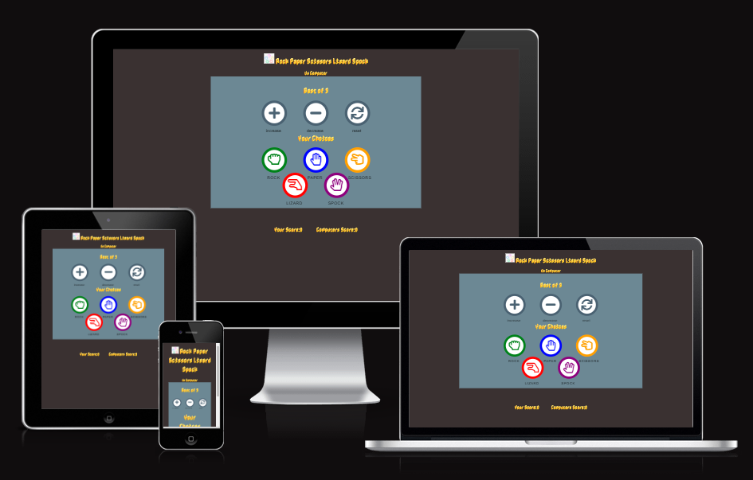
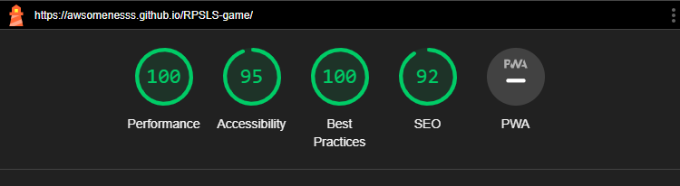
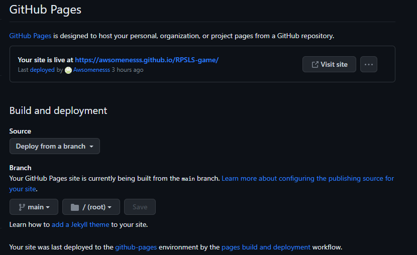

# Rock, Paper, Scissors, Lizard, Spock  Game

## Introduction

Welcome to the Rock, Paper, Scissors, Lizard, Spock game with elements of chance! This game is an extended version of the classic Rock, Paper, Scissors game made famous by the TV show "The Big Bang Theory." In this game, you'll have the opportunity to play against the computer, which will randomly choose one of the five available options: Rock, Paper, Scissors, Lizard, or Spock. Your goal is to beat the computer by selecting a winning move.

### Rules
- Rock crushes Scissors.
- Scissors cuts Paper.
- Paper covers Rock.
- Rock crushes Lizard.
- Lizard poisons Spock.
- Spock smashes Scissors.
- Scissors decapitates Lizard.
- Lizard eats Paper.
- Paper disproves Spock.
- Spock vaporizes Rock.

This game uses programming languages  HTML5, CSS3 and JavaScript to demonstrate interactive game using JavaScript with user experience in mind, featuring an intuitive interface and clear instructions.

A live website can be found [here](https://awsomenesss.github.io/RPSLS-game/).

# Table of Contents

- [Rock, Paper, Scissors, Lizard, Spock  Game](#rock-paper-scissors-lizard-spock--game)
  - [Introduction](#introduction)
    - [Rules](#rules)
- [Table of Contents](#table-of-contents)
- [1. UX](#1-ux)
  - [1.1. Strategy](#11-strategy)
    - [Project Goals](#project-goals)
    - [User Goals](#user-goals)
    - [User Expectations](#user-expectations)
    - [Trends of modern games](#trends-of-modern-games)
    - [Strategy Table](#strategy-table)
  - [Scope](#scope)
    - [Phase 1](#phase-1)
  - [1.2. Structure](#12-structure)
  - [1.3. Skeleton](#13-skeleton)
    - [Wire-frames](#wire-frames)
  - [1.4. Surface](#14-surface)
    - [Colours](#colours)
    - [Typography](#typography)
- [2. Features](#2-features)
    - [All Pages](#all-pages)
    - [Landing Page](#landing-page)
    - [Game Page](#game-page)
  - [3. Technologies Used](#3-technologies-used)
- [4. Testing](#4-testing)
    - [Google Developer Tools](#google-developer-tools)
    - [Responsive Tools](#responsive-tools)
    - [W3C Validator Tools](#w3c-validator-tools)
  - [Manual Testing](#manual-testing)
    - [All Pages](#all-pages-1)
    - [Landing Page](#landing-page-1)
    - [Game Page](#game-page-1)
- [5. Development Cycle](#5-development-cycle)
    - [Landing Page](#landing-page-2)
    - [Game Page](#game-page-2)
- [6. Deployment](#6-deployment)
- [7. Credits](#7-credits)
    -  [Code](#code)
  - [Acknowledgments](#Acknowledgments)

# 1. UX

[Go to the top](#table-of-contents)

Everybody knows the basic Rock, Paper, Scissors game, but not everyone knows about the Rock, Paper, Scissors, Lizard, Spock game which originated from the TV show, Big Bang Theory. This game adds 2 extra weapons, Lizard and Spock. This changes the who dynamic of the game giving the player/s more variety to win.

## 1.1. Strategy

[Go to the top](#table-of-contents)

### Project Goals

The main goal of this game is to create a fun entertaining game that is interactive to the user and to display the use of JavaScript functions.

### User Goals

First Time Visitor Goals

- As a first-time visitor, I want to be engaged with the concept of the game.
- As a first-time visitor, I want to be able to easily understand the rules of the game.
- As a first-time visitor, I want to play the game to win.

Returning Visitor Goals

- As a returnisg visitor, I want to play the game to win.

Frequent User Goals

- As a Frequent User, I want to check to see if there are any newn features

### User Expectations

The game should be engaging and display a winner and loser.

- The selection is clear.
- The user interface is easy to navigate.
- The game is responsive on all devices including mobile, tablet and desktop.

### Trends of modern games

- Mobile gaming (gaming on the go)
- Nostalgia gaming with remastered games
- Virtual reality

### Strategy Table

| Opportunity/Problem/Feature              | Importance | Viability/Feasibility |
| ---------------------------------------- | ---------- | --------------------- |
| Engaging game play                       | 5          | 5                     |
| Improve Rule Clarity                     | 3          | 3                     |
| Score tracking system                    | 5          | 5                     |
| The ability to play against the computer | 5          | 5                     |
| Responsive design                        | 4          | 4                     |

## Scope

As I am unable to include all of the features from the strategy table. Please find below the plan for each.

### Phase 1

- Engaging game play
- Improve Rule Clarity
- Score tracking system
- The ability to play against the computer
- Responsive design

## 1.2. Structure

[Go to the top](#table-of-contents)

It is really important to include responsive design in this project as many users are using different devices (mobile, tablet, laptop/PC). This gives the user the best experience on their device.

- Responsive on all device sizes
- Easy navigation through labelled buttons

## 1.3. Skeleton

[Go to the top](#table-of-contents)

I used [Balsamiq](https://balsamiq.com/) to create my wireframes as this gives the template of the UI. This also shows where all elements will be placed within the screen.

### Wire-frames

index page:

Game page:

## 1.4. Surface

[Go to the top](#table-of-contents)

### Colours

Please find the colours schemes that I used [here](https://coolors.co/f0ffff-0085c7-df0024-f4c300-009f3d).

### Typography

Nabla is used as main font of choice with sans serif to fall back and Raleway for buttons.

# 2. Features

[Go to the top](#table-of-contents)

### All Pages

- Title and logo are placed at the top of the page.
- background  color dark grayish color and bluish-gray were used and for text #e8eaec was used for a visually appealing user interface.

### Landing Page

- Play now button - leads the user to the game page 

- Rules  -  Explains all the rules for the game.
  
- Introduction section  -  Provides a brief explanation of what RPSLS.It aims to make the game approachable and enjoyable for both new and returning players

### Game Page

- Results Area - The results section of the page displays the outcome of each round. It includes the elements for displaying the player's choice, computer's choice, and the round result

- Scoreboard - The scoreboard showsprovides a section for the player to select their desired weapon, with icons for Rock, Paper, Scissors, Lizard, and Spock.
- Attempts Section - this section has Attempt Counter Increase and Decrease Buttons  allow the player to increase or decrease the number of attempts or rounds they want to play Reset Button that resets the game to its initial state.
- Select your weapon - This section allows the player to select their desired weapon. There are 5 icons rock, paper, scissors, lizard, spock.
- Player/Computer choices - This section shows the selection of weapons made by the player and the generated weapon selection for the computer. This uses the same icons as the initial weapon selection part.

- Score area - Player's Score Display the player's current score and Computer's Score display the computer's current score

## 3. Technologies Used

[Go to the top](#table-of-contents)

- [HTML5](https://en.wikipedia.org/wiki/HTML)
  - The project uses HyperText Markup Language.
- [CSS3](https://en.wikipedia.org/wiki/CSS)
  - The project uses Cascading Style Sheets.
- [JavaScript](https://en.wikipedia.org/wiki/JavaScript)
  - The project uses JavaScript.
- [Visual Studio Code](https://code.visualstudio.com/)
  - The project uses Visual Studio Code.
- [Chrome](https://www.google.com/intl/en_uk/chrome/)
  - The project uses Chrome to debug and test the source code using HTML5.
- [Balsamiq](https://balsamiq.com/)
  - Balsamiq was used to create the wireframes during the design process.
- [Google Fonts](https://fonts.google.com/)
  - Google fonts were used to import the "Benne" font into the style.css file which is used on all pages throughout the project.
- [GitHub](https://github.com/)
  - GitHub was used to store the project's code after being pushed from Git.

# 4. Testing

[Go to the top](#table-of-contents)

For every element that I added to my HTML, I would add the basic CSS to my stylesheet. I would then use the inspect element to try different styles. Once I've got it to my liking I would copy the CSS from google into my stylesheet. This allows me to keep track of the code I am using.

### Google Developer Tools

For every element that I added to my HTML, I would add the basic CSS to my stylesheet. I would then use the inspect element to try different styles. Once I've got it to my liking I would copy the CSS from google into my stylesheet. This allows me to keep track of the code I am using.

For all JavaScript functions, i console logged each function to make sure that the output was correct.

I checked the accessibility of the page using lighthouse.

### Responsive Tools

I used [Am I Responsive](http://ami.responsivedesign.is/) and [RESPONSIVE DESIGN CHECKER] (https://www.responsivedesignchecker.com/) to make sure that all my pages are responsive to all devices.

### W3C Validator Tools

I used [W3C Markup](https://validator.w3.org/#validate_by_input+with_options) to check for any errors within my HTML pages.
I had no errors in the index and start_game page.

I used [W3C CSS Validation](https://jigsaw.w3.org/css-validator/) to check for any errors within my CSS stylesheet.
I had no errors in my CSS file.

I used [JS Hint](https://jshint.com/) to check for any errors within my JavaScript file.
I had no errors in my JavaScript files.

## Manual Testing

I have tested my site on Safari and google chrome on multiple devices.

These include:

- iPhone X
- iPhone XS Max
- iPad Pro
- Macbook Pro

Please find below my testing process for all pages via mobile and web:

### All Pages

- Animated background - I tested this on Chrome and Safari on all devices.

  - Text:

    - I checked that all text is in the correct and consistent size and font. I also checked that there were no typos.

  - Responsiveness:
    - I checked that all pages and elements were responsive. Checking each page on mobile and website and adjusting screen size to find breakpoints. It worked as expected.

### Landing Page

- Game Menu Buttons

  - Introduction button - When selecting the "introduction" button, a popup modal appears with a short summary of the game with an embedded video. This worked as expected.
  - Rules button - When selecting the "rules" button, a popup modal appears with rules of the game and a diagram showing the winning outcomes. This worked as expected.
  - Start game button - When selecting the "start game" button, the browser redirects to the game page. This worked as expected.
 
### Game Page

- Scoreboard - I checked that the score board increments the correct score for player and computer.

- Selected option - I checked that the icons are all the same size and display the correct colours when hovering over them.

- Player/Computer choices - I checked that the player button selected appears in the user choice and that the generated computer choice is displaying correctly.

- Main menu button - When selecting the "main menu" button, the browser redirects to the index page.

-  Results - I checked that the result output is displaying the correct outcomes.

# 5. Development Cycle

[Go to the top](#table-of-contents)

No changes all elements initial wireframe.

# 6. Deployment

[Go to the top](#table-of-contents)

# Deployment

### **To deploy the project**
The site was deployed to GitHub pages. The steps to deploy a site are as follows:
  1. In the GitHub repository, navigate to the **Settings** tab.
  2. Once in Settings, navigate to the **Pages** tab on the left-hand side.
  3. Under **Source**, select the branch to **master**, then click **save**.
  4. Once the master branch has been selected, the page will be automatically refreshed with a detailed ribbon display to indicate the successful deployment.

<b>Git Deploy Preview Image</b>

# 7. Credits

# 8. Known Bugs

[Go to the top](#table-of-contents)

- The close "x" button on the popup modals for the index page is not centred. This was rectified by adding padding to the top of the close button.

- The player/CPU labels on the scoreboard for the game page is not vertically aligned. This was rectified by adding padding to the bottom.

- The placeholder text for the contact form popup modal is too close to the left and top side edge, making the characters of the input text hard to read. The was rectified by adding padding to the left side and padding to the top for the message input.

# 9. Credits

[Go to the top](#table-of-contents)

### Code

- The popup modals come from [JS Fiddle](https://jsfiddle.net/kumarmuthaliar/GG9Sa/1/)
- The background animation came from [Code Pen](https://codepen.io/anon/embed/RZogMa?height=500&theme-id=1&slug-hash=RZogMa&default-tab=result#css-box)

### Content

- All images came from [Google Images](https://www.google.com/imghp?hl=en)
- All weapon icons came from [Font Awesome](https://fontawesome.com/v5.15/icons?d=gallery&p=2)
- The winner and loser GIFs came from [GIPHY](https://giphy.com/)
- The game rules came from [Big Bang Theory Wiki](https://bigbangtheory.fandom.com/wiki/Rock,_Paper,_Scissors,_Lizard,_Spock)
